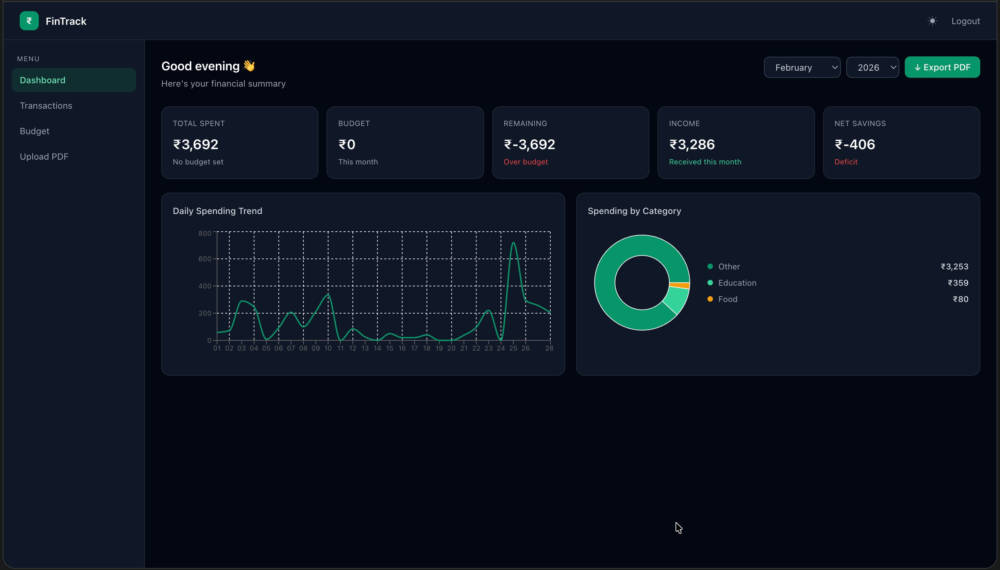
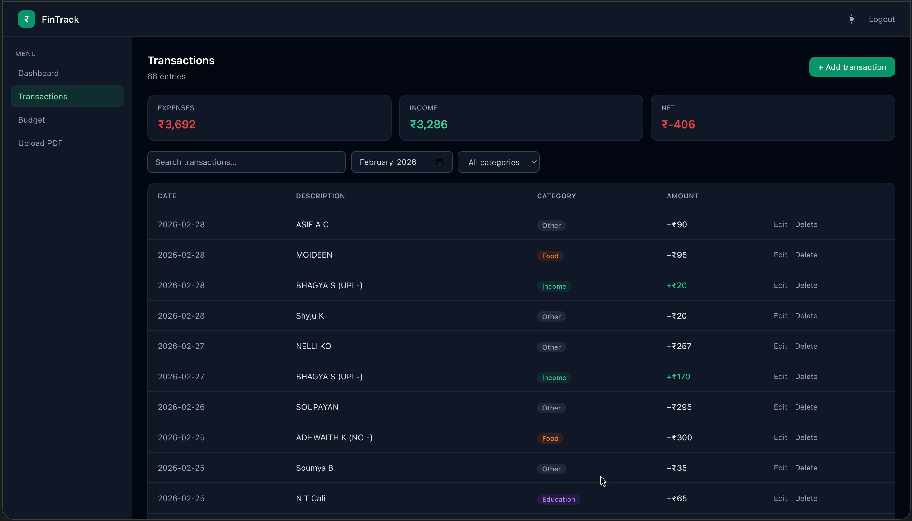
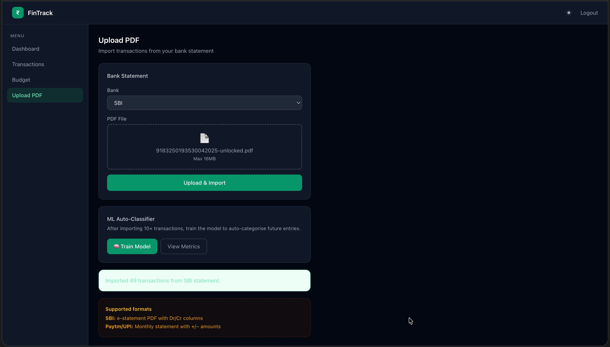
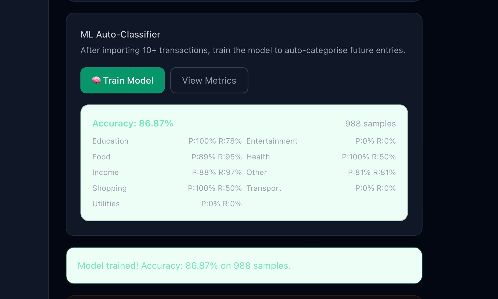

# FinTrack — Personal Finance Dashboard

A full-stack personal finance management app built for college students. Parses real SBI bank statement PDFs, auto-categorises transactions with a trained ML classifier, and gives a live dashboard of spending, income, and budget tracking.

**[Live App](https://fintrack-nine-xi.vercel.app)** · **[Backend API](https://fintrack-oxox.onrender.com)**

---

## Screenshots

### Dashboard
Monthly spending trend, category breakdown, budget tracking, and recurring expense detection — all computed from real imported bank data.



### Transactions
Full CRUD transaction list with search, category filters, and month navigation.



### PDF Upload + ML Auto-Classifier
Upload an SBI bank statement PDF and the parser extracts every transaction automatically, categorising each one using a trained model.



### ML Classifier Metrics
Real precision/recall numbers, not a demo — trained on actual imported transaction data.



---

## Features

- **JWT authentication** — signup/login with secure password hashing
- **CRUD transactions** — add, edit, delete, search, and filter by category or month
- **Monthly budgets** — set a limit, get a visual progress bar, and an alert at 80% usage
- **Category analytics** — pie chart of spending by category, line chart of daily spending trend
- **SBI bank statement PDF parser** — custom-built parser handling both ZIP-archive-based and native-PDF statement exports from SBI Yono, including multi-line wrapped transaction records
- **ML auto-categorisation** — TF-IDF + Logistic Regression classifier (`scikit-learn`) trained on 988 real labelled transactions (86.87% accuracy), with per-prediction confidence scores
- **Recurring expense detection** — flags vendors charging consistently across 3+ months
- **PDF report export** — download a monthly summary as a formatted PDF (ReportLab)
- **Dark mode**

---

## ML Classifier — Real Numbers

Trained on **988 real transactions** spanning 16 months of personal bank statement data (Dec 2024 – Apr 2026).

| Metric | Value |
|---|---|
| Accuracy | 86.87% |
| Samples | 988 |
| Education | P: 100% · R: 78% |
| Food | P: 89% · R: 95% |
| Income | P: 88% · R: 97% |
| Shopping | P: 100% · R: 50% |
| Health | P: 100% · R: 50% |
| Other | P: 81% · R: 81% |

These are honest numbers from a real classification_report on held-out test data — not a cherry-picked demo. Categories with few real-world examples (Transport, Entertainment, Utilities) score lower, which is expected and documented rather than hidden.

---

## Tech Stack

**Frontend:** React, Tailwind CSS, Recharts
**Backend:** Flask, Flask-JWT-Extended, Gunicorn
**Database:** PostgreSQL (Supabase)
**ML:** scikit-learn (TF-IDF + Logistic Regression, `sklearn.pipeline`)
**PDF Parsing:** pdfplumber + custom ZIP-archive extraction
**PDF Export:** ReportLab
**Deployment:** Vercel (frontend) · Render (backend) · Supabase (database)

---

## Architecture Notes

### PDF Parsing
SBI Yono statement exports come in two different underlying formats depending on how they were unlocked/downloaded:
- **ZIP-archive format**: a `.pdf`-named file that is actually a ZIP containing per-page `.txt` extracts, with each transaction on a single line (occasionally wrapped across 2-3 lines for long descriptions).
- **Native PDF format**: a real PDF parsed via `pdfplumber`, where text extraction splits each transaction's description and its date/amount columns across *separate* lines.

The parser uses one unified state-machine that reconstructs full transactions regardless of which format produced the source text, tracking a "pending date" across line boundaries so descriptions and their amounts are correctly paired either way.

### Database
Originally built on SQLite, migrated to PostgreSQL (Supabase) after discovering Render's free-tier filesystem is ephemeral — every redeploy wiped the local SQLite file. Postgres on Supabase persists independently of backend redeploys.

### Performance
The PDF upload route batches its duplicate-check and insert queries (`psycopg2.extras.execute_values`) instead of running one query per transaction. Against a remote database, sequential per-row queries for a 60-70 transaction statement was slow enough to exceed the request timeout; the batched version completes in under a second.

---

## Setup

```bash
# Backend
cd backend
pip install -r requirements.txt
python3 app.py

# Frontend
cd frontend
npm install
npm start
```

### Environment Variables

**Backend** (`.env` or platform env vars):
```
DATABASE_URL=postgresql://...
JWT_SECRET_KEY=your-secret-key
CORS_ORIGINS=http://localhost:3000
```

**Frontend** (`.env`):
```
REACT_APP_API_URL=http://localhost:5000
```

---

## What I'd Improve

- Transport and Entertainment categories have too few real examples to classify well — would need more training data
- Free-tier hosting (Render) cold-starts after 15 minutes of inactivity; kept warm with UptimeRobot pings as a workaround, but a paid tier would be the real production fix
- Currently single-bank (SBI) support; the parser architecture could extend to other banks with bank-specific line-pattern definitions

---

*Built by Ankush Kumar, NIT Calicut*